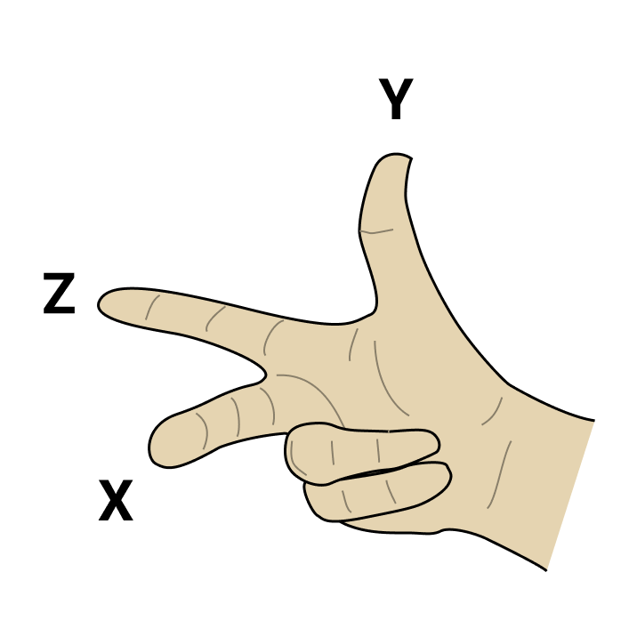
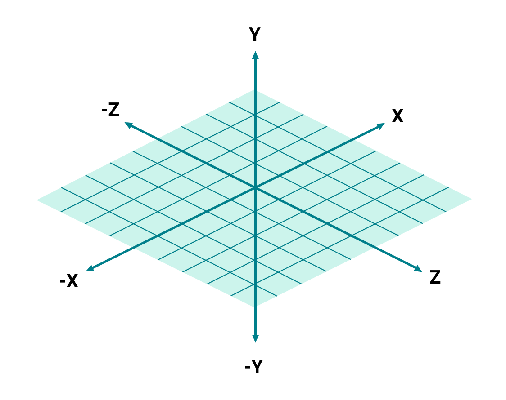

#### <sup>:closed_book: [workshop-generative-art](../README.md) → Cheat Sheet</sup>

---

# Cheat Sheet

Here you will find some 'recipes' and patterns that you can use in creative coding and generative art.

## New Array

You can use `Array.from(new Array(count))` to create a dense array at a fixed size. For example, to generate an array of 20 random numbers:

```js
const count = 20;
const randoms = Array.from(new Array(count)).map(() => Math.random());
```

## Array with values `0...1` (inclusive)

Using `index / (listLength - 1)`, you can get a *t* value between 0 and 1.

Example:

```js
const count = 20;
const values = Array.from(new Array(count)).map((_, i) => {
  const t = i / (count - 1);
  // Do something with the 't' param...
  return t;
});
```

To guard against a `count` of <= 1:

```js
const count = 20;
const values = Array.from(new Array(count)).map((_, i) => {
  const t = count <= 1 ? 0 : (i / (count - 1));
  return t;
});
```

## Grids & UV Coordinates

During the workshop, when I say "UV coordinates" I am referring to coordinates that vary from `(0, 0)` (top left) to `(1, 1)` (bottom right).

For example, to create a UV grid with nested for loops:

```js
const count = 5;
const points = [];
for (let x = 0; x < count; x++) {
  for (let y = 0; y < count; y++) {
    const u = count <= 1 ? 0.5 : (x / (count - 1));
    const v = count <= 1 ? 0.5 : (y / (count - 1));
    points.push([ u, v ]);
  }
}
```

## Padding with Margins using Linear Interpolation

If you have UV coordinates for a surface between `(0, 0)` (top left) and `(1, 1)` (bottom right), you can use linear interpolation to get back pixel values for each coordinate:

```js
const { lerp } = require('canvas-sketch-util/math');

// ...

const x = lerp(minX, maxX, u);
const y = lerp(minY, maxY, v);
```

Let's say you want a margin of `20px` in your `[ width, height ]` artwork, you can do this:

```js
const margin = 20;
const x = lerp(margin, width - margin, u);
const y = lerp(margin, height - margin, v);
```

## Noise from UV Coordinates

If you have UV coordinates between `0..1`, you can get back a *simplex noise* signal from those coordinates that smoothly varies between `-1...1`.

```js
const random = require('canvas-sketch-util/random');

const frequency = 1;
const amplitude = 1;

const n = amplitude * random.noise2D(u * frequency, v * frequency);
```

The `frequency` changes how chaotic the noise signal will be, and the `amplitude` can be used to scale the value to something smaller or larger than `-1..1` range.

## Animated Noise

By using a higher dimension noise function, you can animate the noise by a `{ time }` or `{ playhead }` variable from `canvas-sketch` props.

```js
const settings = {
  // Enable animation & time props
  animate: true
};

canvasSketch(() => {
  return ({ context, time }) => {
    const frequency = 1;
    const amplitude = 1;

    // Use 3D instead of 2D noise
    const n = amplitude * random.noise3D(u * frequency, v * frequency, time);
  };
}, settings);
```

## `0..1` to `-1...1`

If *t* is between 0 and 1 (inclusive) and you want to map it to -1 to 1 (inclusive), you can use this:

```js
const n = t * 2 - 1;
```

## `-1..1` to `0...1`

If *t* is between -1 and 1 (inclusive) and you want to map it to 0 to 1 (inclusive), you can use this:

```js
const n = t * 0.5 + 0.5;
```

## Mapping One Range of Numbers to Another

You can also use the `mapRange` function in `canvas-sketch-util/math` to map one range of values to another:

```js
const { mapRange } = require('canvas-sketch-util/math');

// Our input lies between -1..1
const value = -0.25;

// Map the input range -1..1 to the output range 25..50
const n = mapRange(value, -1, 1, 25, 50);
```

This is equivalent to:

```js
const { inverseLerp, lerp } = require('canvas-sketch-util/math');

// Get a 0..1 represenation of the value within the given range
const t = inverseLerp(-1, 1, value);

// Now interpolate that to our output range of 25..50
const n = lerp(25, 50, t);
```

## Fill a Circle in Canvas 2D

```js
context.beginPath();
context.arc(x, y, radius, 0, Math.PI * 2, false);
context.fill();
```

## Rotating Shapes in Canvas 2D

If you'd like to draw a shape rotated from its centre point, you need to first translate to the point you wish to draw the shape, then rotate, then offset by the center point of the shape. For example:

```js
// Draw a rotated rectangle
const x = 25;
const y = 50;
const rectWidth = 100;
const rectHeight = 30;
const rotation = Math.PI / 4;

context.save();
context.translate(x, y);
context.rotate(rotation);
context.translate(-rectWidth / 2, -rectHeight / 2);
context.fillRect(0, 0, rectWidth, rectHeight);
context.restore();
```

## Creating a 2D Unit Vector from an Angle

A unit vector is a really handy construct for doing generative art. You can create one from an angle like so:

```js
// angle is in radians
const normal = [ Math.cos(angle), Math.sin(angle) ];
```

## Creating a Line Segment from a 2D Normal

If you have a 2D unit normal (or an angle, see the previous recipe), you can create a line segment of a specific length and thickness like so:

```js
const { vec2 } = require('gl-matrix');

const normal = [ /* a 2D unit vector ... */ ];
const length = 2;
const thickness = 4;

// The center of the line segment
const center = [ 250, 100 ];

// Extrude in either direction
const line = [ -1, 1 ].map(dir => vec2.scaleAndAdd([], center, normal, dir * length));

// Draw line segment
context.beginPath();
line.forEach(([ x, y ]) => context.lineTo(x, y));
context.lineWidth = thickness;
context.stroke();
```

## Looping Motion in `-1..1` Range

To create a looping motion from `-1..1` you can use `Math.sin()`, like so:

```js
const motionSpeed = 0.5;
const v = Math.sin(time * motionSpeed);
```

You can map this value into `0..1` space and/or interpolate it to another range.

## Ping-Pong Motion in `0..1` Range

When you have a defined sketch `{ duration }` and you are using the `{ playhead }` prop, you can use `Math.sin()` to get a ping-pong motion from `0..1` which slowly varies from 0, to 1, and then back to zero.

```js
const v = Math.sin(playhead * Math.PI);
```

You can invert this with `1.0 - v` if you need it to vary from 1, to 0, and then back to 1.

## Isometric ThreeJS Camera

In your setup, replace the perspective camera with:

```js
const camera = new THREE.OrthographicCamera();
```

In the `resize` function, replace the perspective camera configuration with:

```js
const aspect = viewportWidth / viewportHeight;

// Ortho zoom
const zoom = 1.0;

// Bounds
camera.left = -zoom * aspect;
camera.right = zoom * aspect;
camera.top = zoom;
camera.bottom = -zoom;

// Near/Far
camera.near = -100;
camera.far = 100;

// Set position & look at world center
camera.position.set(zoom, zoom, zoom);
camera.lookAt(new THREE.Vector3());

// Update the camera
camera.updateProjectionMatrix();
```

## 3D Coordinate System

Here's a small reference you can use to remember XYZ axes in ThreeJS.

 

## Third-Party GLSL Modules

With [glslify](https://github.com/glslify/glslify) (built-in to canvas-sketch CLI), we can import GLSL modules and snippets directly form npm into our shader code.

For example, after running `npm install glsl-noise`, you can use this:

```js
// Import glslify
const glsl = require('glslify');

// Wrap your GLSL string with glslify function
const frag = glsl(`
  precision highp float;

  // We can now import GLSL snippets from npm into this shader
  #pragma glslify: noise = require('glsl-noise/simplex/3d');

  uniform float time;
  varying vec2 vUv;

  void main () {
    float d = noise(vec3(vUv, time));
    vec3 color = vec3(d);
    gl_FragColor = vec4(color, 1.0);
  }
`);
```

## Looping Noise

You can use the following to blend 2D noise seamlessly in a GIF/MP4 loop.

```js
function loopNoise (x, y, t, scale = 1) {
  const duration = scale;
  const current = t * scale;
  return ((duration - current) * random.noise3D(x, y, current) + current * random.noise3D(x, y, current - duration)) / duration;
}
```

## 

#### <sup>[← Back to Documentation](../README.md)