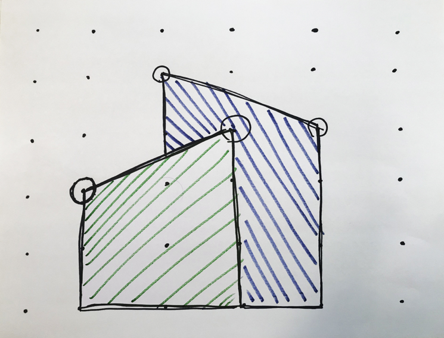
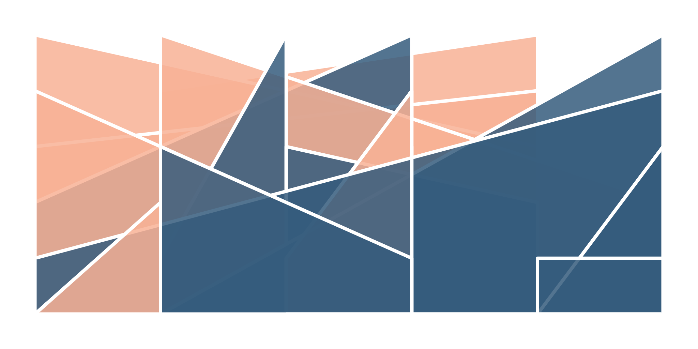

#### :closed_book: [workshop-generative-art](../README.md) → Exercises

---

# Exercises

Here are some exercises to try during lunch & free coding periods. Like a Sol LeWitt artwork, you are given the instructions, and its your task to implement it with code and a generative system.

- [Generative Poster Designs](#pie)
- [Generative Sol LeWitt Inspired Wall Drawing](#wall)

<a name="pie" />

## Generative Poster Designs

This is a sketch trying to recreate [these poster designs](https://twitter.com/hyper_yolo/status/1116208688522383360) by Amie Chen ([@hyper_yolo](https://twitter.com/hyper_yolo/status/1116208688522383360)).

Instructions:

- Create an evenly spaced grid across the page
- At each point in the grid, draw a 75%-filled pie chart shape at 0º, 90º, 180º or 270º rotation
- Fill the background with a random pastel colour

Results:

Hints:

- Try using `Random.pick` from [canvas-sketch-util/random](https://github.com/mattdesl/canvas-sketch-util/blob/master/docs/random.md) to select a random angle from a set of 4
- Try creating the pie shape with `arc()` (which has `start` and `end` angle parameters) and `moveTo()` to finish the shape by placing the pen back in the center of the circle
- You can calculate the radius by using some equation like so:  
  `radius = width / (gridColumnCount - 1) * scaleFactor`

You can find the solution in `src/2d/10-pie-charts.js`.

## Generative Sol LeWitt Inspired Wall Drawing

This is a more advanced example for those looking to challenge themselves. The result is a unique generative system inspired by the ideas of Sol LeWitt and his instruction-based wall drawings.

Instructions:

- Using a 6x6 grid of evenly spaced points
- Connect two random points on the grid; forming a trapezoid with two parallel sides extending down
- Fill the trapezoid with a colour, then stroke with the background colour
- Find another two random points and repeat; continuing until all grid points are exhausted
- Layer the shapes by the average Y position of their two grid points

Sketch:

Example Outputs:

You can find the solution in `src/2d/07-advanced-wall-drawing.js`.

## 

#### [← Back to Documentation](../README.md)